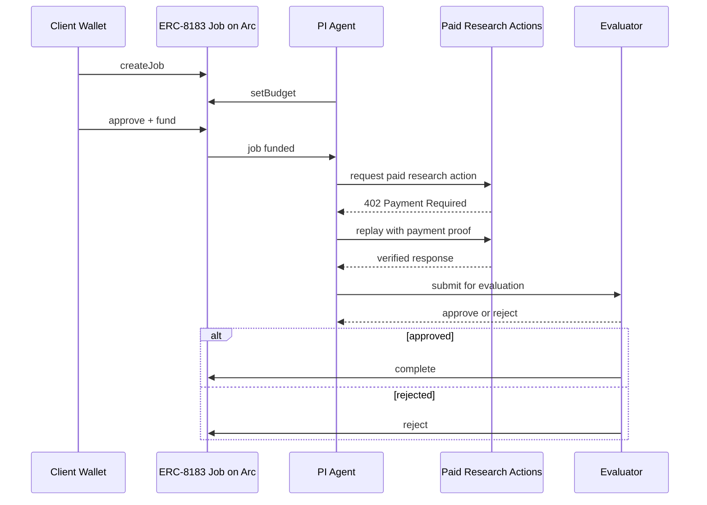

# Veliora

Veliora is a multi-agent biomedical research system for drug repurposing that funds workflows in USDC, runs evidence-driven pipelines, and delivers structured, traceable research briefs.

Built for the Agentic Economy on Arc Hackathon
## Categories:

### Usage-Based Compute Billing

- Per-step paid research actions
- Pricing tied to actual execution

### Real-Time Micro-Commerce Flow

- Payments are triggered dynamically during the workflow
- Economic activity is driven by task progression

### Agent-to-Agent Payment Loop

- Agents coordinate funded actions across the workflow
- Machine-to-machine value flow follows task progression

---

## Links

- Live app: https://veliora.vercel.app/
- Demo video: [Watch on YouTube](https://youtu.be/yENv4v6XU7U)
- Slides PDF: [veliora.pdf](docs/assets/veliora.pdf)

---

## Overview

Veliora is a multi-agent biomedical research system that turns a disease-focused query into a structured repurposing analysis workflow.

A user funds a research job in **USDC**, and the system coordinates specialist agents across literature mining, drug database screening, pathway analysis, hypothesis generation, evidence scoring, red-team review, and final report synthesis.

The result is a **research brief**, not a medical advice.

Veliora is intentionally selective:
- it may return a strong shortlist,
- a weaker exploratory hypothesis,
- pipeline-reviewed signals that did not advance into a scored shortlist,
- or no deliverable at all.

Two output types should be read differently:

- **Pipeline-reviewed signals**  
  Early mechanism-linked leads examined by the core workflow across literature, drug, pathway, and evidence scoring. These are exploratory and are not the same as a final shortlist.
- **Red-team challenged candidates**  
  Stronger reportable candidates that advanced far enough to be stress-tested by the red-team layer before delivery.

---

## Problem

Biomedical research workflows are composed of many specialized steps:

- literature retrieval and filtering  
- drug and target screening  
- pathway and biology anchoring  
- evidence evaluation and critique  

These steps are difficult to coordinate economically.

Traditional payment systems:
- make research actions too expensive,
- bundle work into opaque services,
- and provide limited visibility into multi-stage workflows.

This makes it hard to build modular, auditable, and fairly priced research pipelines.

---

## Solution

Veliora combines an **agentic research workflow** with a **multi-layer payment system**:

- **ERC-8183 on Arc** → job escrow, lifecycle, and resolution  
- **x402 + Circle Gateway** → per-step paid research actions  
- **Arc** → fast finality and a USDC-native settlement layer  

This enables:

- escrowed research jobs  
- per-action paid services  
- traceable workflow execution  
- peer-reviewed delivery  
- rejection + refund for weak outputs  

Veliora turns fragmented research steps into a coordinated, economically viable system.

---

## Key Features

- Escrowed research jobs via **ERC-8183**
- Paid per-step research actions via **x402 + Circle Gateway**
- Multi-agent workflow with specialized roles
- Review-gated delivery and refund-on-rejection
- Traceable evidence pipeline from input to output

---

## Use Case

A user submits a disease-focused request, such as:

- Idiopathic pulmonary fibrosis
- Type 2 Diabetes
- Multiple sclerosis
- Alzheimer’s disease
- Parkinson’s disease
- Triple-negative breast cancer

> “What repurposable compounds may be relevant for this condition based on literature, pathway context, and known targets?”

The system:

1. creates and funds a job in USDC
2. dispatches specialist agents
3. executes paid research steps
4. gathers and scores candidate evidence
5. challenges reportable candidates when a scored shortlist is available
6. assembles the final research brief and review outcome
7. delivers a shortlist, surfaces exploratory signals, or rejects the run

### Output behavior

- **Strong signal** → report delivered  
- **Weak signal** → exploratory report  
- **No scored shortlist, but usable early leads** → pipeline-reviewed signals surfaced as exploratory context  
- **No defensible result** → rejected + refunded  

---

## Screenshots

### Workspace — Approved Delivery

### Workspace — Rejected / Refunded

### Report Summary

### Methodology

### Report Sections

---

## System Architecture

Veliora operates across three layers:

- **Client Layer**  
  Job creation, USDC approval, and escrow funding via ERC-8183 on Arc  

- **Execution Layer**  
   PI agent orchestrates the funded workflow across literature, DrugDB, pathway, repurposing, evidence, red-team critique, report synthesis, and peer review.

- **Resolution Layer**  
  Evaluator completes or rejects the job and triggers escrow payout or refund  

### Sequence Diagram

Paid research actions cover literature, DrugDB, pathway, red-team critique, and peer review, while repurposing, evidence scoring, and report synthesis remain in the PI-led core orchestration layer.

### Agent Roles

| Agent       | Responsibility                                                                     |
| ----------- | ---------------------------------------------------------------------------------- |
| PI Agent    | Orchestrates the workflow, manages the escrow state, and dispatches research steps |
| Literature  | Retrieves and filters disease-relevant papers from the literature layer            |
| DrugDB      | Screens molecules, targets, and activity-linked candidate context                  |
| Pathway     | Anchors disease biology through pathway, genetic, and clinical trial context       |
| Repurposing | Generates candidate hypotheses from upstream evidence                              |
| Evidence    | Scores and prioritizes the strongest candidate signals                             |
| Red Team    | Challenges shortlisted candidates once a scored list is available                  |
| Report      | Synthesizes findings into a structured research brief                              |
| Reviewer I  | Verifies methodology, provenance, and report completeness                          |
| Reviewer II | Checks consistency across candidate, evidence, and scoring fields                  |
| Tiebreaker  | Resolves disagreements when reviewers reach different conclusions                  |

### Data Sources by Agent

- **Literature**  
  Uses **PubMed / NCBI** for paper retrieval, **PubMed Central** when full-text artifacts are available, and **OpenAlex** for citation enrichment and ranking context.

- **DrugDB**  
  Uses **ChEMBL** for molecule, target, and activity-linked candidate context.

- **Pathway**  
  Uses **Open Targets** plus linked pathway, genetic, and active clinical-trial context, including **ClinicalTrials.gov** references where available.

---

## Payment Architecture

Veliora separates payments into three layers:

### 1. Job Escrow (ERC-8183)

- Client funds job in USDC  
- Evaluator completes or rejects  
- Approved jobs trigger escrow payout
- Rejected jobs are refunded  

---

### 2. Paid Research Actions (x402 + Circle Gateway)

Used during execution for:
- literature retrieval  
- DrugDB queries  
- pathway analysis  
- read team critique
- peer review

Flow:

1. request resource
2. receive `x402 Payment Required`
3. sign authorization
4. replay with payment
5. seller verifies payment and serves the resource
6. Gateway batches authorizations and settles them on Arc

**Price:** `0.002 USDC` per action  

- Repurposing, evidence scoring, and report synthesis remain in the core orchestration layer.

---

### 3. Internal Payouts

- Triggered after successful completion  
- Distributed across based on contribution 
- Not executed for rejected jobs  

---

## Transaction Evidence

The funded workflow is documented and supported by a batch-level transaction summary covering escrow funding, seller settlement evidence, run-level execution, and the micropayment ledger.

Full transaction summary: [artifacts/hackathon-batch/transaction-summary.md](./artifacts/hackathon-batch/transaction-summary.md)

ArcScan references for ERC-8183 role activity:
- Provider / PI wallet (`0x871bf9e2a99de1bd47a2a0c4d1056349eb4ab8a8`) — `setBudget` and `submit`transactions
 https://testnet.arcscan.app/address/0x871bF9E2A99DE1bD47a2a0c4D1056349eB4AB8a8?tab=txs

- Evaluator wallet (`0x99f89acf1a0db9665452a8fa5b50c43757e320a1`) — `complete` transactions
https://testnet.arcscan.app/address/0x99f89acf1a0dB9665452A8fA5b50c43757E320A1?tab=txs

---

## Tech Stack

### Web Application

- **Next.js**
- **TypeScript**

### Backend / Deployment

- **Node.js**
- **SQLite**
- **Vercel**
- **Railway**

### Blockchain / Settlement
- **Arc**  
  Fast finality and a USDC-native settlement layer  
- **ERC-8183**  
  Job escrow and resolution lifecycle  
- **USDC**  
  Funding and settlement currency  

### Payment Infrastructure
- **Circle Wallets**  
  Developer-controlled wallets for role-based wallet operations  
- **Circle Gateway**  
  Gasless authorization and batched nanopayment settlement  
- **x402**  
  Paid API-style access to research actions  

---

## Evidence Model

Veliora evaluates outputs across:

- literature support  
- biological relevance  
- clinical evidence  
- safety profile  
- genetic context  

Outputs are **research prioritization artifacts**

Full rubric: [REPORT_QUALITY_RUBRIC.md](REPORT_QUALITY_RUBRIC.md)

---

## Report Policy

Veliora is intentionally selective.

### Deliver
- strong shortlist exists  

### Conditional deliver
- exploratory hypothesis  

### Reject
- no defensible signal  
- review fails  

Rejected jobs are refunded onchain.

---

## Summary

Veliora is a payment-aware, multi-agent biomedical research pipeline.

It combines:
- **ERC-8183** for escrowed jobs  
- **x402 + Circle Gateway** for per-step payments  
- **Arc** for fast finality and USDC-native settlement  

The result is a system that can execute, evaluate, and economically structure complex research workflows with selective, review-gated outputs.
