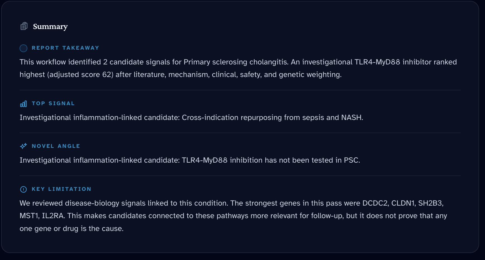
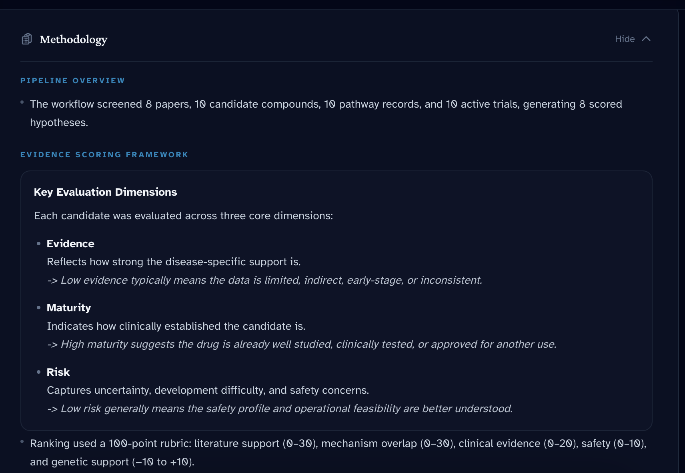
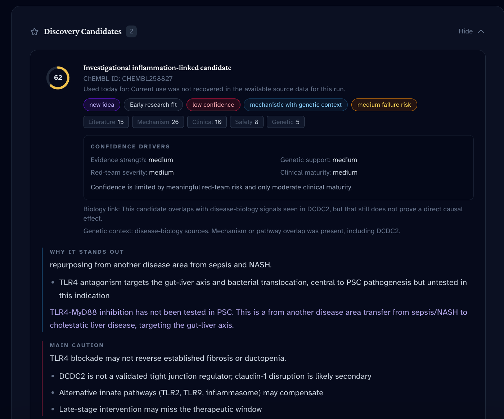
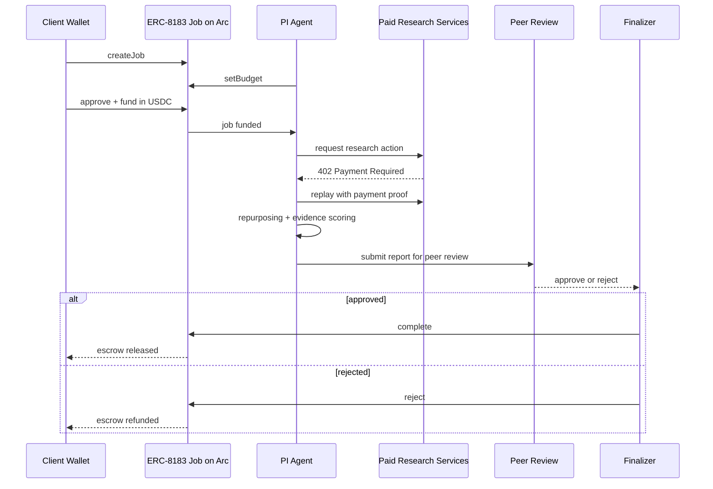

# Veliora

Agentic biomedical research workflow for drug repurposing analysis, powered by programmable payment rails.

Built for the **Agentic Economy on Arc Hackathon**  
Categories:
- Usage-Based Compute Billing
- Real-Time Micro-Commerce Flow

## Live Links

- Live app: `TODO`
- Demo video: `TODO`
- Slides PDF: `TODO`

---

## Overview

Veliora is a multi-agent biomedical research system that turns a disease-focused query into a structured repurposing analysis workflow.

A user funds a research job in **USDC**, and the system coordinates multiple specialist agents across literature mining, drug database screening, pathway analysis, hypothesis generation, evidence scoring, red-team review, and final report synthesis.

The result is a **research brief**, not a treatment recommendation.

Veliora is designed to be selective. It returns:
- a strong shortlist,
- or a weaker exploratory hypothesis,
- or no deliverable at all.

If the output does not pass review, the job is rejected and the escrow is refunded onchain.

## Key Features

- Escrowed research jobs through ERC-8183 on Arc
- Paid per-step research actions through x402 + Circle Gateway
- Multi-agent workflow with named specialist roles
- Review-gated delivery and refund-on-rejection behavior
- Selective output policy instead of forced answers
- Traceable research stages from intake to report resolution

---

## Problem

Biomedical research workflows are expensive to coordinate because they are made up of many small, specialized steps such as:

- retrieving and filtering literature,
- screening candidate drugs and targets,
- anchoring candidates to disease biology,
- scoring evidence quality,
- and running independent review.

These steps are often too fragmented for traditional payment rails.

Paying for each small research action individually is usually:
- operationally heavy,
- too expensive for low-value actions,
- and difficult to audit across a multi-stage workflow.

As a result, it is hard to build a research pipeline where many agents or services can be paid fairly and efficiently per action.

---

## Solution

Veliora solves this by combining an **agentic research workflow** with a **two-layer payment architecture**:

- **ERC-8183 on Arc** manages the outer job lifecycle:
  create, fund, submit, complete, or reject.
- **x402 + Circle Gateway** handle low-value paid research actions inside the workflow.
- **Arc** provides fast finality and a USDC-native settlement layer.

This directly addresses the coordination problems in biomedical research workflows:

| Workflow problem | How Veliora solves it |
| --- | --- |
| Research work is bundled into one opaque service | Veliora breaks literature retrieval, DrugDB screening, pathway analysis, and review into distinct workflow steps. |
| Research pricing is forced into a subscription-style model | Veliora supports **per-task** and **per-step** payment flows tied to the actual work performed. |
| Multi-stage execution loses visibility | Veliora keeps evidence collection and stage progression traceable across the workflow. |
| Outputs can be delivered without review | Veliora inserts peer review before final delivery. |
| Weak results can still be charged for | Veliora supports rejection and onchain refund behavior for non-defensible outputs. |

In short, Veliora makes multi-step biomedical research economically practical.

---

## Use Case

A user submits a disease-focused research question such as:

> “What repurposable compounds may be relevant for this disease area based on literature, pathway context, and known targets?”

The workflow then:

1. creates and funds a research job in USDC,
2. dispatches specialist agents,
3. pays external research services as needed,
4. synthesizes candidate hypotheses,
5. evaluates evidence strength,
6. runs adversarial review,
7. prepares a final research brief,
8. and either delivers or rejects the result.

### Example output behavior

- **Strong evidence + review approval**  
  A report is delivered and the job is completed.

- **Weak but still interesting signal**  
  A report may still be delivered, but clearly labeled as exploratory.

- **No defensible signal**  
  The job is rejected and the client escrow is refunded.

---

## Screenshots

### Report Summary

### Methodology

### Discovery Candidates

---

## System Architecture

Veliora is built as a payment-aware multi-agent research pipeline.

The architecture has three connected layers:

- **Client job layer**  
  The client creates a job, approves USDC, and funds escrow through ERC-8183 on Arc.

- **Research execution layer**  
  The PI agent orchestrates literature, DrugDB, pathway, repurposing, evidence, red-team critique, report synthesis, and peer review.

- **Resolution layer**  
  The finalizer either completes the job and releases escrow or rejects the job and refunds it.

### Sequence Diagram

### Agent roles

| Agent | Responsibility |
| --- | --- |
| **Dr. Iris · PI Agent** | Orchestrates the workflow, manages paid service calls, tracks progress, and handles submission or rejection. |
| **Dr. Mira · Literature** | Mines and prioritizes literature evidence. |
| **Dr. Rex · DrugDB** | Screens drug, target, and candidate-molecule context. |
| **Dr. Nova · Pathway** | Anchors the analysis in disease biology. |
| **Dr. Spark · Repurposing** | Generates and filters candidate hypotheses. |
| **Dr. Vera · Evidence** | Scores evidence across literature, biology, clinical signal, safety, and genetics. |
| **Dr. Vale · Red Team** | Performs adversarial review and surfaces weaknesses. |
| **Dr. Aria · Report** | Produces the final research brief. |
| **Review I / Review II / Tiebreak** | Final peer-review layer that determines approval or rejection. |

---

## Payment Architecture

Veliora uses three distinct payment paths across the research workflow.

### 1. ERC-8183 Job Escrow — Client Funds the Research Job

**When:** a user starts a new biomedical research run

This is the outer payment contract of the system.

The client:
- creates a job,
- approves USDC,
- funds escrow on Arc,
- and waits for the report to be either completed or rejected.

How it works:
1. the client creates the job on Arc,
2. the PI side sets the budget,
3. the client funds the escrow in USDC,
4. the workflow runs,
5. the finalizer either completes the job or rejects it,
6. if rejected, the escrow is refunded.

Why it matters:
This gives Veliora a real marketplace-style lifecycle instead of a simple paywall.

### 2. x402 + Circle Gateway — Paid Research Actions Inside the Workflow

**When:** the PI agent needs to buy a low-value research action during execution

This is the internal payment path for usage-based research work.

Examples:
- literature retrieval,
- DrugDB screening,
- pathway analysis,
- red-team review,
- peer review.

How it works:
1. the PI agent requests a paid research resource,
2. the seller returns `402 Payment Required`,
3. the PI signs a Circle Gateway authorization,
4. the request is replayed with payment proof,
5. settlement is batched later on Arc.

Why it matters:
This is what makes low-value, high-frequency research actions economically viable.

**Configured default nanopayment:**  
- `0.002 USDC` per paid action

### 3. Internal Budget Distribution — Post-Completion Agent Payouts

**When:** a report is approved and the research job completes successfully

This is the internal value-distribution path after delivery.

Funds can be distributed to internal downstream roles such as:
- repurposing,
- evidence,
- report.

How it works:
1. the job completes successfully,
2. the system calculates internal payout shares,
3. budget is allocated based on contribution and risk weights,
4. rejected jobs do not trigger these payouts.

Why it matters:
This separates client escrow, external paid services, and internal agent economics into clear layers.

### Why This Structure Matters

Veliora is not using one payment rail for everything.

It uses:
- **ERC-8183** for client-facing job escrow,
- **x402 + Circle Gateway** for paid per-step research execution,
- **internal payout logic** for downstream agent reward allocation.

That separation is important because each payment path solves a different economic problem:
- client trust,
- paid workflow execution,
- and internal value sharing.

---

## Tech Stack

### Blockchain / Settlement
- **Arc**  
  Fast finality and a USDC-native settlement layer
- **ERC-8183**  
  Job escrow and resolution lifecycle
- **USDC**  
  Funding and settlement currency

### Payment Infrastructure
- **Circle Gateway**  
  Gasless authorization and batched nanopayment settlement
- **x402**  
  Paid API-style access to research actions

### Research Workflow
- Multi-agent orchestration
- Literature mining
- Drug database screening
- Pathway analysis
- Hypothesis generation
- Evidence scoring
- Red-team review
- Final report synthesis

### Output / Evaluation Layer
- Peer review
- Delivery gating
- Refund-on-rejection logic
- Structured research brief generation

---

## Evidence Model

Veliora uses a structured evidence rubric across:

- literature support,
- biology overlap,
- clinical evidence,
- safety profile,
- genetic context.

Genetic evidence is used as disease-biology context, not as causal proof or medical validation.

Outputs are **research prioritization artifacts**, not medical advice.

For the full scoring criteria, see [REPORT_QUALITY_RUBRIC.md](REPORT_QUALITY_RUBRIC.md).

---

## Report Policy

Veliora is intentionally selective.

### Deliverable
- A reportable shortlist exists

### Conditionally deliverable
- Only an early-stage hypothesis exists, but it is clearly labeled as exploratory

### Reject
- No reportable candidate
- No meaningful early-stage hypothesis
- Review does not approve the report

If rejected, the escrow is refunded onchain.

---

## Why Veliora Matters

Veliora demonstrates that biomedical research workflows can be:

- modular,
- agent-driven,
- economically coordinated,
- payment-aware,
- and auditable end to end.

Instead of treating research as a single opaque service, Veliora breaks it into specialized paid actions while preserving delivery control, review quality, and settlement logic.

This makes it a strong example of how agentic systems can support real-world, low-value, high-frequency knowledge work.

## Hackathon Track Alignment

Veliora aligns most directly with the following Arc hackathon tracks:

### 🧮 Usage-Based Compute Billing

Veliora prices research as a sequence of smaller paid actions rather than a single opaque software fee.

How it aligns:
- the PI agent triggers discrete research tasks such as literature retrieval, DrugDB screening, pathway analysis, red-team review, and evaluator review,
- these actions can be paid individually through **x402 + Circle Gateway**,
- this makes pricing proportional to actual workflow activity rather than a flat subscription model.

Why it matters:
Biomedical research is not one homogeneous compute event. It is a chain of specialized steps with different cost and value profiles. Veliora turns that into a usage-based economic model.

### 🛒 Real-Time Micro-Commerce Flow

Veliora creates a real-time buyer and seller flow inside the research pipeline.

How it aligns:
- the client funds a research job in **USDC**,
- the PI agent then purchases specific research actions from internal or external service layers,
- the workflow is reviewed,
- and the final result is either delivered or rejected with refund behavior.

Why it matters:
This is not deferred accounting or end-of-month settlement. Economic activity is triggered by the workflow itself, step by step, as the research run progresses.

### 🤖 Agent-to-Agent Payment Loop

Veliora demonstrates machine-driven economic coordination between specialized roles.

How it aligns:
- the **PI agent** acts as the orchestrator and budget manager,
- specialist agents and seller endpoints contribute literature, DrugDB, pathway, red-team, and review work,
- value moves through the system as agents request, perform, and validate work in sequence.

Why it matters:
Veliora shows that agents are not just producing text. They are coordinating paid actions, consuming services, and participating in an economically meaningful workflow.

### 🪙 Per-API Monetization Engine

Veliora can also be understood as a biomedical per-request monetization model.

How it aligns:
- research steps can be exposed as paid API-style actions,
- each call can be priced independently in USDC,
- the x402 flow supports per-request charging for valuable research operations.

Why it matters:
This turns domain-specific biomedical services into monetizable, composable building blocks instead of a single monolithic product.

### Strongest Track Fit

1. **Usage-Based Compute Billing**
2. **Real-Time Micro-Commerce Flow**

Secondary alignment:
- **Agent-to-Agent Payment Loop**
- **Per-API Monetization Engine**

---

## Additional Docs

- [JUDGE-GUIDE.md](docs/JUDGE-GUIDE.md)
- [DEMO-WALKTHROUGH.md](docs/DEMO-WALKTHROUGH.md)
- [ARCHITECTURE.md](docs/ARCHITECTURE.md)
- [examples/README.md](examples/README.md)

---

## Summary

Veliora is a payment-aware, multi-agent biomedical research pipeline for drug repurposing analysis.

It combines:
- **ERC-8183** for escrowed research jobs,
- **x402 + Circle Gateway** for paid low-value research actions,
- and **Arc** for final settlement.

The result is a system that can gather evidence, review it, and either deliver a structured brief or reject the run and refund the user.
