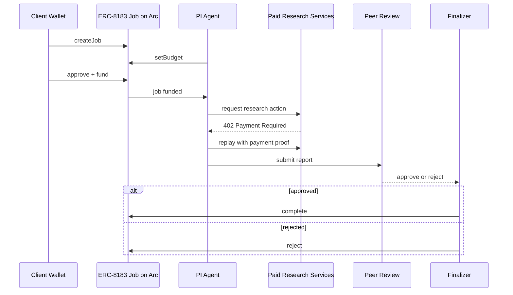

# Veliora

Agentic biomedical research workflow for drug repurposing analysis, powered by programmable payment rails.

Built for the **Agentic Economy on Arc Hackathon**  
Categories:
- Usage-Based Compute Billing
- Real-Time Micro-Commerce Flow

---

## Live Links

- Live app: `TODO`
- Demo video: `TODO`
- Slides PDF: `TODO`

---

## Overview

Veliora is a multi-agent biomedical research system that turns a disease-focused query into a structured repurposing analysis workflow.

A user funds a research job in **USDC**, and the system coordinates specialist agents across literature mining, drug database screening, pathway analysis, hypothesis generation, evidence scoring, red-team review, and final report synthesis.

The result is a **research brief**, not a treatment recommendation.

Veliora is intentionally selective:
- it may return a strong shortlist,
- a weaker exploratory hypothesis,
- or no deliverable at all.

---

## Problem

Biomedical research workflows are composed of many specialized steps:

- literature retrieval and filtering  
- drug and target screening  
- pathway and biology anchoring  
- evidence evaluation and critique  

These steps are difficult to coordinate economically.

Traditional payment systems:
- make small research actions too expensive,
- bundle work into opaque services,
- and provide limited visibility into multi-stage workflows.

This makes it hard to build modular, auditable, and fairly priced research pipelines.

---

## Solution

Veliora combines an **agentic research workflow** with a **multi-layer payment system**:

- **ERC-8183 on Arc** → job escrow, lifecycle, and resolution  
- **x402 + Circle Gateway** → per-step paid research actions  
- **Arc** → fast finality and a USDC-native settlement layer  

This enables:

- escrowed research jobs  
- per-action paid services  
- traceable workflow execution  
- peer-reviewed delivery  
- rejection + refund for weak outputs  

Veliora turns fragmented research steps into a coordinated, economically viable system.

---

## Key Features

- Escrowed research jobs via **ERC-8183**
- Paid per-step research actions via **x402 + Circle Gateway**
- Multi-agent workflow with specialized roles
- Review-gated delivery and refund-on-rejection
- Traceable evidence pipeline from input to output

---

## Use Case

A user submits a disease-focused query:

> “What repurposable compounds may be relevant based on literature, pathway context, and known targets?”

The system:

1. creates and funds a job in USDC  
2. dispatches specialist agents  
3. executes paid research steps  
4. generates and scores hypotheses  
5. runs adversarial review  
6. produces a research brief  
7. delivers or rejects the result  

### Output behavior

- **Strong signal** → report delivered  
- **Weak signal** → exploratory report  
- **No defensible result** → rejected + refunded  

---

## System Architecture

Veliora operates across three layers:

- **Client Layer**  
  Job creation, USDC approval, and escrow funding via ERC-8183 on Arc  

- **Execution Layer**  
  PI agent orchestrates research across literature, DrugDB, pathway, repurposing, evidence, and review  

- **Resolution Layer**  
  Finalizer completes or rejects the job and triggers settlement or refund  

### Sequence Diagram

### Agent Roles

| Agent | Responsibility |
|------|----------------|
| **PI Agent** | Orchestrates workflow and manages budget |
| Literature | Evidence retrieval |
| DrugDB | Drug and target screening |
| Pathway | Disease biology anchoring |
| Repurposing | Hypothesis generation |
| Evidence | Evidence scoring |
| Red Team | Adversarial review |
| Report | Final synthesis |
| Reviewers | Approval / rejection |

---

## Payment Architecture

Veliora separates payments into three layers:

### 1. Job Escrow (ERC-8183)

- Client funds job in USDC  
- Finalizer completes or rejects  
- Approved jobs trigger settlement  
- Rejected jobs are refunded  

---

### 2. Paid Research Actions (x402 + Circle Gateway)

Used during execution for:
- literature retrieval  
- DrugDB queries  
- pathway analysis  
- review steps  

Flow:
1. request resource  
2. receive `402 Payment Required`  
3. sign authorization  
4. replay with payment  
5. batched settlement on Arc  

**Default price:** `0.002 USDC` per action  

---

### 3. Internal Payouts

- Triggered after successful completion  
- Distributed based on contribution and risk  
- Not executed for rejected jobs  

---

## Tech Stack

### Blockchain / Settlement
- **Arc**  
  Fast finality and a USDC-native settlement layer  
- **ERC-8183**  
  Job escrow and resolution lifecycle  
- **USDC**  
  Funding and settlement currency  

### Payment Infrastructure
- **Circle Gateway**  
  Gasless authorization and batched nanopayment settlement  
- **x402**  
  Paid API-style access to research actions  

### Workflow
- Multi-agent orchestration  
- Literature mining  
- Drug database screening  
- Pathway analysis  
- Hypothesis generation  
- Evidence scoring  
- Red-team review  

---

## Evidence Model

Veliora evaluates outputs across:

- literature support  
- biological relevance  
- clinical evidence  
- safety profile  
- genetic context  

Outputs are **research prioritization artifacts**, not medical advice.

Full rubric: [REPORT_QUALITY_RUBRIC.md](REPORT_QUALITY_RUBRIC.md)

---

## Report Policy

Veliora is intentionally selective.

### Deliver
- strong shortlist exists  

### Conditional deliver
- exploratory hypothesis  

### Reject
- no defensible signal  
- review fails  

Rejected jobs are refunded onchain.

---

## Hackathon Alignment

### Usage-Based Compute Billing
- Per-step paid research actions  
- Pricing tied to actual execution  

### Real-Time Micro-Commerce Flow
- Agents trigger payments dynamically  
- Workflow drives economic activity  

### Additional
- Agent-to-agent payment loops  
- Per-API monetization model  

---

## Summary

Veliora is a payment-aware, multi-agent biomedical research pipeline.

It combines:
- **ERC-8183** for escrowed jobs  
- **x402 + Circle Gateway** for per-step payments  
- **Arc** for fast finality and USDC-native settlement  

The result is a system that can execute, evaluate, and economically structure complex research workflows with selective, review-gated outputs.
